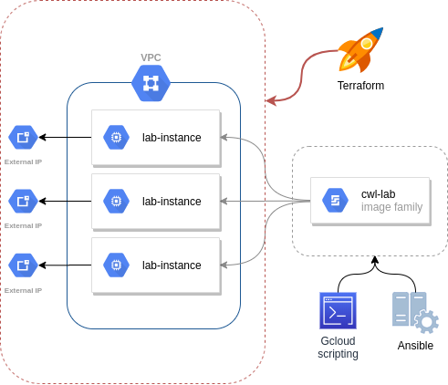

# GCWL lab installer on GCE

Configure an environment for CWL training on Google Compute Engine.

Using these scripts you can build a golden-image equipped with tools to run
CWL tutorials. The image is used for instantiate a network of public hosts
accessible by students using ssh.



# Features

* Golden image baking fully automated using Gcloud SDK scripts and Ansible.

* Google Compute infrastructure provisioned using Terraform.

* Global remote terraform state stored in a Google Cloud Bucket to ease the
  collaboration between members of the admin team.

# Requirements

* [Ansible](https://www.ansible.com/)
  * You will need a Python environment with packages specified in
    golden-image/requirements.txt

* [Gcloud SDK](https://cloud.google.com/sdk/)

* [Terraform](https://www.terraform.io/)

# Quickstart

* [Configure the access to Google Cloud](https://cloud.google.com/sdk/docs/initializing).

* Retrieve the credentials needed to operate with Terraform and Ansbile (it's strongly advised to use a specific service account):
  ```
  gcloud iam service-accounts keys create ./credentials.json --iam-account xxxxxxxxxxxxx@developer.gserviceaccount.com
  ``` 
  Copy it where required:
  ```
  cp ./credentials.json golden-image/ansible/
  cp ./credentials.json lab-networking/
  cp ./credentials.json lab-hosts/
  ```

* Create/Update the golden image:
  ```
  cd golden-image
  ```
  ```
  make build_all
  ```
  Check if it's ok:
  ```
  make check_image_family
  ```

* Create the network infrastructure
  ```
  cd lab-networking
  ```
  Configure the terraform variables (project_id, network_name).
  And run terraform:
  ```
  terraform init
  terraform apply
  ```
* Create the hosts
  ```
  cd lab-hosts
  ```
  Configure the terraform variables (project_id, network_name).
  And run terraform:
  ```
  terraform init
  terraform apply
  ```
At the end you should have an output indicating the public IPs and the
passwords for the user "student".
```
default_passwords = {
  "lab-instance-0" = "asdfasdfasdf"
  "lab-instance-1" = "qwerqwerreqw"
  "lab-instance-2" = "zxcvzxcvzxcc"
}
instances_ips = [
  [
    "35.246.45.152",
    "35.197.230.139",
    "35.189.105.83",
  ],
]
```

# Acknoledgements

This project is a fork of [terraform-codelab](https://github.com/morgante/terraform-codelab), used in
the Qwiklab tutorial [VM Migration: Planning](https://www.qwiklabs.com/focuses/6899).


